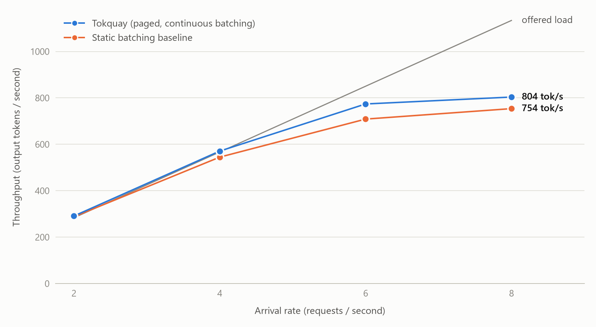
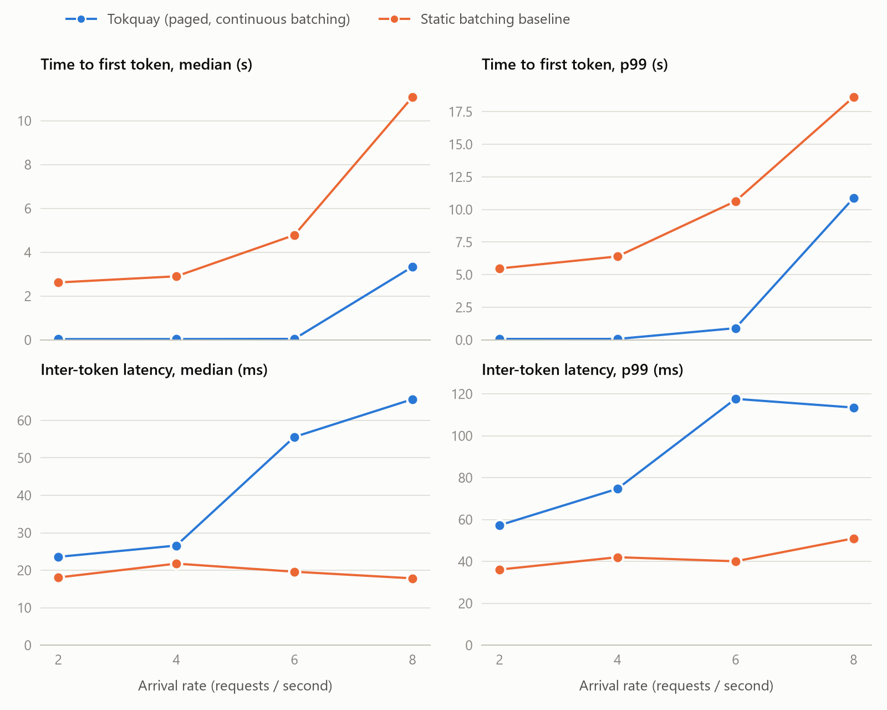
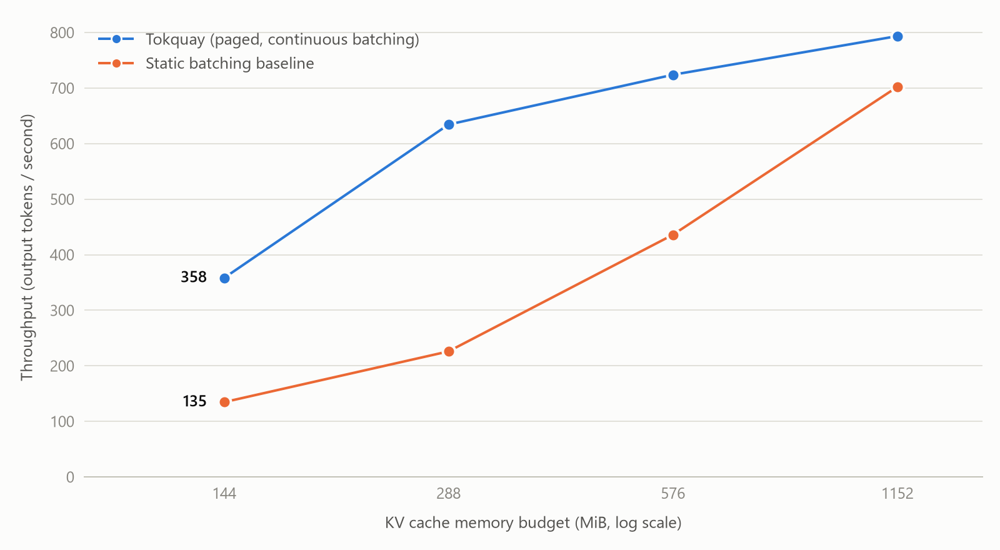

# Tokquay

A from-scratch LLM inference engine. GPT-2 (124M) is served from a hand-written forward pass with a **paged KV cache** and **continuous batching**, and measured against a static-batching baseline. There is no `model.generate()` and there are no custom kernels; `transformers` supplies only the weights and the tokenizer.

The two ideas, as in vLLM:

1. **Paged KV cache.** KV memory is one preallocated pool of fixed-size blocks. Each sequence owns a block table, like a process owns a page table, so nothing is reserved for the maximum length up front.
2. **Continuous batching.** The scheduler admits and evicts requests at every decode step, so a batch never waits for its slowest member.

## Results

Measured on an RTX 3050 Laptop GPU (4 GiB), fp32, GPT-2 124M. 300 requests per run, Poisson arrivals, prompt and output lengths each uniform in [16, 256] tokens; outputs are fixed-length so both systems do identical work. **Both systems get the same KV-cache budget**: 16,384 token slots (1.125 GiB). Tokquay turns it into 1,024 blocks of 16 tokens; the baseline into 32 rows of 512 slots (a generous choice for the baseline: a server that does not know output lengths in advance has to reserve the model's full 1,024 positions per row).

<picture>
  <source media="(prefers-color-scheme: dark)" srcset="Documentation/img/throughput_vs_rate_dark.png">
  
</picture>

**What the numbers say**

- **Time to first token is the big win.** At 2 to 6 requests/s Tokquay's median TTFT is 36 to 45 ms (p99 at most 0.9 s). The baseline's is 2.6 to 4.8 s (p99 5.5 to 10.6 s), because a static batch admits nobody until it has fully drained.
- **Less KV memory for the same work.** At 4 requests/s Tokquay peaked at 568 MiB of KV in use, the baseline at 1,152 MiB (it reserves `max_len` per row). Mean KV utilisation, the share of allocated slots that hold a token: 97% vs 44%.
- **Throughput is about the same at light load** (291 vs 288 tok/s at 2 requests/s): both keep up with what arrives. From 4 to 8 requests/s, with the full budget, Tokquay is 5 to 9% ahead, and 29% ahead when all requests arrive at once (916 vs 708 tok/s). The sweep margin is about the size of the run-to-run noise (the baseline's identical 8 requests/s configuration measured 754 and 702 tok/s), so treat it as "a little ahead", not as a result.
- **The throughput win is real when memory is the constraint.** Same workload at 8 requests/s, shrinking the KV budget:

  | KV budget | Tokquay | Static baseline |
  |---|---:|---:|
  | 16,384 slots (1,152 MiB) | 794 tok/s | 702 tok/s |
  | 8,192 (576 MiB) | 724 | 436 |
  | 4,096 (288 MiB) | 634 | 226 |
  | 2,048 (144 MiB) | 358 | 135 |

  Tokquay with 288 MiB is within 10% of the baseline with 1,152 MiB. It gets there by preempting and recomputing (218 to 235 preemptions per run at the smaller budgets); see the design notes for what that costs.
- **The cost is inter-token latency.** Tokquay's median ITL is 24 to 27 ms at 2 to 4 requests/s against 18 to 22 ms, and 56 to 66 ms against about 18 to 20 ms at 6 to 8 requests/s. Two causes are visible in the data: at high load it runs twice as many sequences per step (64 vs 32), and prefill steps stall decoding (5 to 28% of token gaps contain a prefill step, and those gaps are 1.5 to 2 times as long). A third likely cause, that paged attention here is plain PyTorch and gathers K/V into a copy every step where a fused kernel would not, was not isolated.

| At 4 requests/s | Static baseline | Tokquay |
|---|---:|---:|
| Throughput (tok/s) | 544.8 | 570.9 |
| TTFT p50 / p99 (ms) | 2,901 / 6,400 | 38 / 74 |
| ITL p50 / p99 (ms) | 21.8 / 42.0 | 26.6 / 74.7 |
| Peak KV memory in use (MiB) | 1152 | 568 |
| Max concurrent seqs | 32 | 32 |

| At 8 requests/s (saturated) | Static baseline | Tokquay |
|---|---:|---:|
| Throughput (tok/s) | 753.8 | 803.7 |
| TTFT p50 / p99 (ms) | 11,076 / 18,615 | 3,332 / 10,873 |
| ITL p50 / p99 (ms) | 17.8 / 51.0 | 65.6 / 113.5 |
| Peak KV memory in use (MiB) | 1152 | 1152 |
| Max concurrent seqs | 32 | 64 |

<picture>
  <source media="(prefers-color-scheme: dark)" srcset="Documentation/img/latency_vs_rate_dark.png">
  
</picture>

<picture>
  <source media="(prefers-color-scheme: dark)" srcset="Documentation/img/throughput_vs_kv_budget_dark.png">
  
</picture>

All tables, including KV utilisation, prefill stalls, block size 16 vs 32, repeat runs and the GPU memory health of every run, are in [`Documentation/results.md`](Documentation/results.md), generated from the saved results.

### How far to trust these numbers

- One laptop GPU, one request trace per configuration, no confidence intervals. Repeating the 4 requests/s runs gave throughput within 1% (571 vs 567 tok/s; 545 vs 542). At saturation the spread was larger (up to 7%).
- **Two environment effects distorted early runs and had to be controlled.** Both were found by noticing numbers that could not be right, and both were large:
  1. PyTorch's caching allocator grew to fill the whole 4 GiB card during the paged gather at 64 sequences, Windows began spilling GPU memory to system RAM, and some decode steps took 0.6 to 1.5 s instead of about 50 ms. The benchmark caps the allocator at 80% of VRAM (`--memory-fraction`).
  2. The CPU (i5-12450H) has performance and efficiency cores, decode steps here are bound by how fast Python can launch kernels, and the OS moved the thread between core types: identical work measured 2x apart. The benchmark pins itself to the performance cores at high priority (`--cpu-affinity FF --high-priority`).

  Both settings are recorded in the results, and every run records its allocator health. Details are in [`Documentation/design-notes.md`](Documentation/design-notes.md). Numbers from another machine will differ; the qualitative picture is what to compare.

## Quick start

```bash
uv sync
uv run pytest                        # downloads the GPT-2 weights on first use
uv run python main.py --port 8000    # the server (add --gpu-memory-fraction 0.8 on a 4 GiB Windows GPU)
```

```bash
curl -s localhost:8000/generate -H 'content-type: application/json' \
     -d '{"prompt": "The capital of France is", "max_tokens": 16}'

curl -N localhost:8000/generate -H 'content-type: application/json' \
     -d '{"prompt": "Once upon a time", "max_tokens": 40, "temperature": 0.8, "top_k": 40, "stream": true}'
```

`POST /generate {prompt, max_tokens, temperature, top_k, stream}` returns JSON, or Server-Sent Events with one event per token when `stream` is true. Optional `seed` makes sampling reproducible and `ignore_eos` forces a fixed length. `GET /health` reports queue lengths and free KV blocks.

Reproducing the benchmark (drop the placement flags on a machine without a hybrid CPU):

```bash
uv run python -m bench.bench calibrate --n 64 --cpu-affinity FF --high-priority
uv run python -m bench.bench sweep --rates 2,4,6,8 --n 300 --cpu-affinity FF --high-priority
uv run python -m bench.bench blocksize --rates 8 --n 300 --cpu-affinity FF --high-priority
uv run python -m bench.bench pool --rate 8 --n 300 --cpu-affinity FF --high-priority
uv run python -m bench.bench report      # writes Documentation/results.md and the plots
```

## Design decisions

Each is written up with its measurements in [`Documentation/design-notes.md`](Documentation/design-notes.md).

- **Block size, 16 vs 32.** Doubling the block size doubled the wasted slots (mean KV utilisation 96.7% to 93.5%). Throughput differed by less than the run-to-run noise, so 16 is the default.
- **Recompute vs swap for preemption.** At the tighter budgets 28 to 30% of the token positions the model runs are recomputation, but all prefill steps together (recomputation included) take 7 to 15% of run time. That bounds what swapping to CPU could save, before paying for the copies, so recompute stays.
- **Chunked prefill (not implemented).** With prompts up to 256 tokens the longest prefill step observed was 81 ms, a few decode steps. Chunking would trim a modest ITL tail here; it matters for long prompts and expensive models, which this benchmark does not cover.
- **Prefill and decode never share a step.** A padded batch would make every one-token decode row pay for the longest prompt in the step. The price is the prefill stalls above.
- **The engine runs on its own thread** and is the only one that touches scheduler state; the event loop talks to it through a queue.

## Layout

```
tokquay/
  model.py         GPT-2 forward pass written by hand; attention reads KV through a batch view
  kv_cache.py      BlockAllocator (pool, free list, ref counts) and PagedBatch (block-table gather/scatter)
  sequence.py      per-request state and sampling parameters
  scheduler.py     FCFS continuous batching, token budget, preemption by recompute, abort
  engine.py        the step loop: schedule, forward, sample, stop conditions
  async_engine.py  runs the engine on one thread and streams tokens to asyncio queues
  server.py        FastAPI: POST /generate (JSON or SSE), GET /health
  detokenizer.py   incremental decoding that never emits half of a multi-byte character
  baseline.py      the static-batching baseline (contiguous KV reserved at max_len per row)
bench/
  workload.py      Poisson arrivals, uniform prompt and output lengths
  harness.py       drives either system in real time; TTFT, ITL, throughput, KV, stalls
  bench.py         calibrate / sweep / blocksize / pool / report
  report.py        results.md and the plots
tests/             the model against HuggingFace, cache and paging equivalence, scheduler and
                   engine, the server end to end, the baseline, and the benchmark's own metrics
Documentation/     brief.md (the spec), design-notes.md, results.md, img/
```

## Not implemented

Custom CUDA or Triton kernels (so no fused paged attention), prefix caching (the brief's stretch goal), swap-to-CPU preemption, chunked prefill, multi-GPU, beam search, an OpenAI-compatible API. The static baseline does greedy decoding only. The server is one process with one engine.

## References

- Kwon et al., *Efficient Memory Management for LLM Serving with PagedAttention* (SOSP '23)
- Yu et al., *Orca: A Distributed Serving System for Transformer-Based Generative Models* (OSDI '22)
